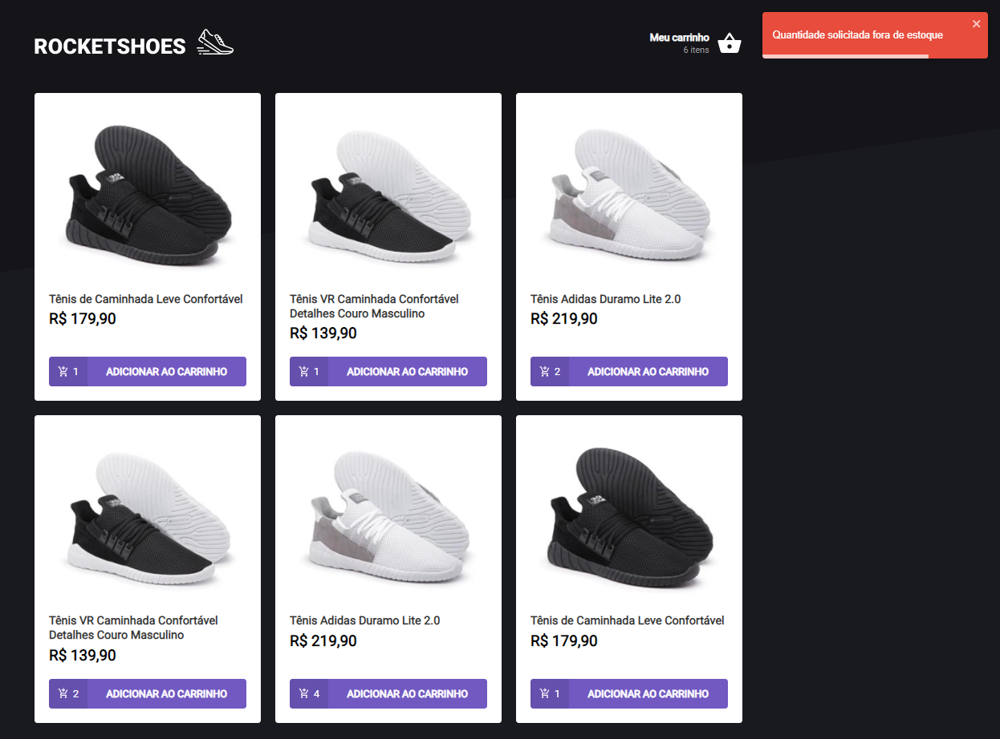
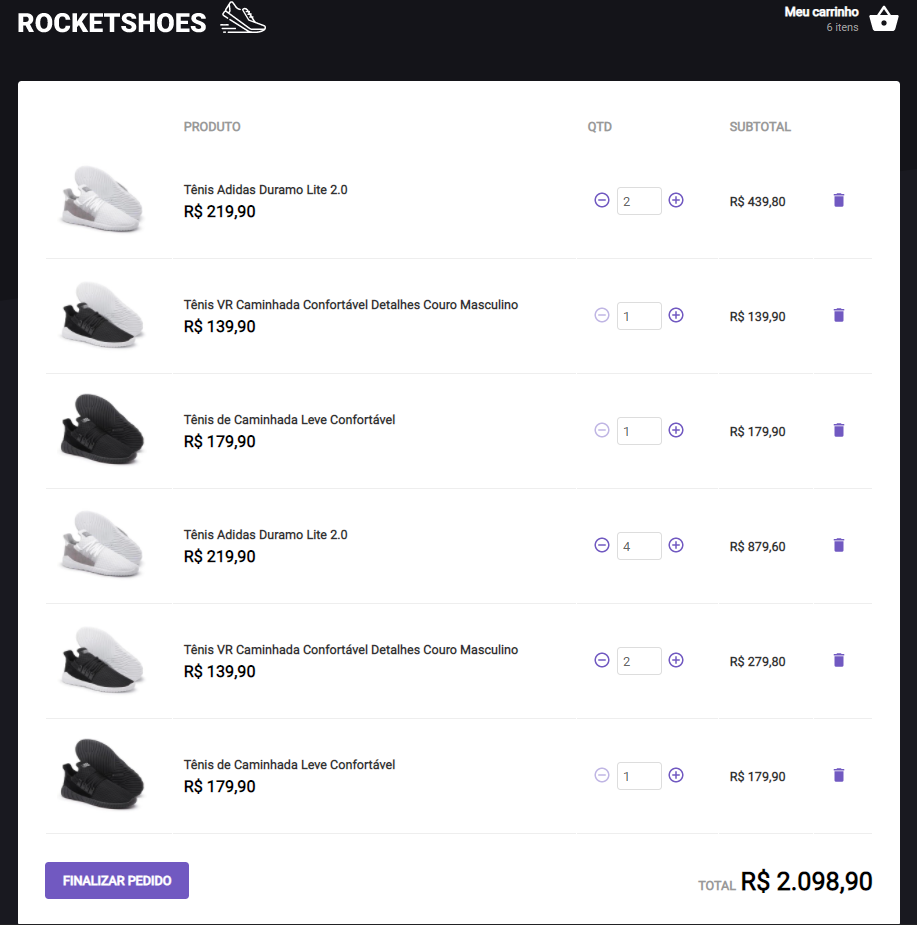

<p align="center">
   
</p>

<p align="center">
 <a href="#projeto">Projeto</a> •
 <a href="#tecnologias">Tecnologias Utilizadas</a> •
 <a href="#execucao">Como Executar</a> •
 <a href="#documentacao">Documentação</a> •
 <a href="#licenca">Licença</a> •
 <a href="#autor">Autor</a> •
 <a href="#contato">Contato</a> 
</p>

--------------------------- 

# :fire: <Strong> Obrigado por visualizar este repositório </Strong> 

<p align="justify"> Primeiramente, olá me chamo Gabriel Kenji Poli Ozaki, sou um estudante de Ciência da Computação e estou querendo atuar na área de Desenvolvimento Web como Desenvolvedor Front-end. </p>

## :computer: <strong id="projeto">Sobre o Projeto </strong>




<p align="justify"><strong>Rocketshoes</strong> é um <strong>e-commerce</strong> voltado a venda de sneakers.

### :pushpin: Funcionabilidades

- [x] Adicionar produtos no carrinho
- [x] Remover produtos no carrinho
- [x] Escolher quantidade do produto
- [x] Verificar todos os produtos selecionados no carrinho

<p align="justify">Essa aplicação Rocketshoes foi desenvolvida como parte de um desafio do Bootcamp Ignite organizada pela empresa Rocketseat.</p>

## :rocket: <Strong id="tecnologias"> Tecnologias Utilizadas </Strong>

<p align="justify"> Este projeto foi desenvolvido utilizando as seguintes tecnologias: </p>

[](https://reactjs.org/) [](https://www.typescriptlang.org/)

<ul>
  <li><a href="https://pt-br.reactjs.org/docs/hooks-intro.html" rel="nofollow">React Hooks</a></li>
  <li><a href="https://fkhadra.github.io/react-toastify/introduction" rel="nofollow">React-toastify</a></li>
  <li><a href="https://react-icons.github.io/react-icons/#/" rel="nofollow">React Icons</a></li>
</ul>

## :runner: <strong id="execucao"> Como executar o projeto </strong>

[](https://classic.yarnpkg.com/en/docs/install/#windows-stable)

```bash
# Fazer o clone do Repositorio.
>> git clone https://github.com/WD-GabrielKenji/Ignite-Rocketshoes.git
```

```bash
# Necessario baixar as dependencias necessárias e iniciar o servidor de desenvolvimento e da API:

# Instalar as dependencias: 
>> yarn

# Iniciar a API Fake do JSON SERVER:
>> yarn server

# Iniciar o servidor de desenvolvimento:
>> yarn start
```

<pre>
Agora basta acessar <a href="http://localhost:3000" rel="nofollow"><code>localhost:3000</code></a> no Browser e usufruir da aplicação!
</pre>

## :book: <strong id="documentacao"> Detalhes aprofundados sobre o projeto </strong>

<details>
<summary>
  Documentação com os detalhes do projeto...
</summary>

<br>

<p align="justify"> *Em construção...* </p>

</details>

## :closed_book: <strong id="licenca"> Licença </strong>


Esse projeto esta sob a licença MIT. Veja o arquivo [LICENSE](LICENSE) para mais detalhes.

## :boy: <strong id="autor"> Autor </strong>

<a href="https://github.com/WD-GabrielKenji">
 
 <br />
 <sub><b>Gabriel Kenji Poli Ozaki</b></sub></a> <a href="https://github.com/WD-GabrielKenji" title="Perfil Github"> :star2: 
</a>

Feito de ❤️ por Gabriel Kenji Poli Ozaki - Desenvolvedor Front-end 👋🏽

### :mailbox_with_mail: <strong id="contato"> Redes Sociais para Contato: </strong>

Entre em contato, atraves destas redes sociais:

[](https://www.linkedin.com/in/wdkenji/)  [](https://www.instagram.com/biel.kenjii/)  [](mailto:g.kenjijss@gmail.com)

[](https://github.com/WD-GabrielKenji)